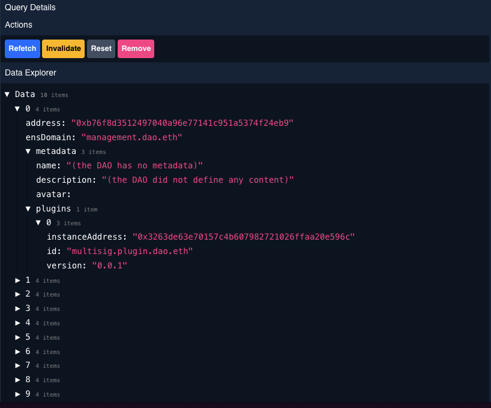

# Getting Started with useAragon: Part 1 - Setup

Welcome to the first part of the tutorial series on how to get started with `useAragon`! This tutorial will guide you through setting up your environment and integrating useAragon into your project. By the end of this tutorial, you'll have a basic understanding of the underlying technologies and why useAragon is so awesome. So let's get started!

<br/>

# Getting Started

There's 2 ways to go around this repository:

1. You can clone it and build on top of it. At which point, you merely want to fork the main branch and run:

```bash
pnpm install && pnpm run start
```

2. You want to use it as a tutorial, at which point, follow the flow below 🙂. You can tap into each step through going into the branches.
   Run `npm run dev` in your terminal, and then open [localhost:3000](http://localhost:3000) in your browser.

Once the webpage has loaded, changes made to files inside the `src/` directory (e.g. `src/pages/index.tsx`) will automatically update the webpage.

<br/>

# Step 1: Create your project

First, we need to create a new project using the pnpm package manager. If you haven't already installed pnpm, you can do so by running npm install -g pnpm. Then, run the following command:

```bash
pnpm create wagmi --template next-rainbowkit
```

This command will create a new project based on the next-rainbowkit template, which is a fantastic starting point for building Web3 applications.

<br/>

# Step 2: Install the required packages

Now that your project is set up, let's install some required packages:

```bash
pnpm i @chakra-ui/react @emotion/react @emotion/styled framer-motion react-icons @chakra-ui/pro-theme
```

These packages include Chakra UI, a popular component library for React, and some additional dependencies for styling and animations.

<br/>

# Step 3: Set up ChakraProvider

Open the \_app.tsx file in the pages directory and remove the `NextHead` import. Then, import the ChakraProvider and wrap our `Component` with it:

```typescript
// pages/_app.tsx
import { ChakraProvider } from "@chakra-ui/react";
import { ColorModeScript } from "@chakra-ui/react";

function MyApp({ Component, pageProps }) {
  return (
    <WagmiConfig client={client}>
      <RainbowKitProvider chains={chains}>
        <ChakraProvider>
          {mounted && <Component {...pageProps} />}
        </ChakraProvider>
      </RainbowKitProvider>
    </WagmiConfig>
  );
}

export default MyApp;
```

<br/>

# Step 4: Set up the theme

Next, let's set up the theme for our project. Add the following code at the top of the \_app.tsx file, under the last imports:

```typescript
import { theme as proTheme } from "@chakra-ui/pro-theme";
import { extendTheme, theme as baseTheme } from "@chakra-ui/react";
import { ColorModeScript } from "@chakra-ui/react";

export const theme = extendTheme(
  {
    colors: { ...baseTheme.colors, brand: baseTheme.colors.blue },
  },
  proTheme
);
```

Now, add the theme prop to the ChakraProvider and the ColorModeScript:

```typescript
<ChakraProvider theme={theme}>
  <ColorModeScript initialColorMode="dark" />
  {mounted && <Component {...pageProps} />}
</ChakraProvider>
```

Open the index.tsx file and clear everything out from the return statement. Let's add some basic layout to make sure Chakra UI is set up correctly:

```typescript
return (
  <Center>
    <VStack spacing={4} pt={10}>
      <ConnectButton />
      <Box borderRadius="lg" boxShadow="sm" p="6">
        {isConnected && <Account />}
      </Box>
    </VStack>
  </Center>
);
```

<br/>

# Step 5: Add the useAragon hooks

Now, let's install the `@daobox/use-aragon` package:

```bash
pnpm i @daobox/use-aragon
```

Back in the `_app.tsx` file, add the `AragonProvider` under the `RainbowKitProvider`:

```typescript
import { AragonProvider } from "@daobox/use-aragon";

// ...

function MyApp({ Component, pageProps }) {
  return (
    <WagmiConfig client={client}>
      <RainbowKitProvider chains={chains}>
        <AragonProvider>
          <ChakraProvider theme={theme}>
            <ColorModeScript initialColorMode="dark" />
            {mounted && <Component {...pageProps} />}
          </ChakraProvider>
        </AragonProvider>
      </RainbowKitProvider>
    </WagmiConfig>
  );
}

export default MyApp;
```

<br/>

# Step 6: Explore React Query Dev Tools

Navigate back to the UI, and you will notice a red flower icon in the bottom left. These are the React Query dev tools. React Query is an incredible library that serves as the foundation for useAragon, offering numerous benefits such as:

- Caching
- Automatic refetching
- Deduping
- Performance

By leveraging React Query, useAragon becomes a more powerful, flexible, and user-friendly library, making it an excellent choice for developers building Web3 applications. Fun fact, its also the library [wagmi hooks]() are built with hence why the syntax should look very fimiliar.

<br/>

# Step 7: Use useFetchDaos hook

Now on to the fun bit. under the `useAccount` hook, add `const daos = useFetchDaos()`. If it didn't auto-import, add it with `import { useFetchDaos } from "@daobox/use-aragon"`. your `index.ts` file should look something like this

```typescript
import { Box, Center, VStack } from "@chakra-ui/react";
import { useAccount } from "wagmi";
import { useFetchDaos } from "@daobox/use-aragon";
import { ConnectButton } from "@rainbow-me/rainbowkit";

function Page() {
  const { isConnecting } = useAccount();
  const daos = useFetchDaos();

  return (
    <Center>
      <VStack spacing={4} pt={10}>
        <ConnectButton />
        <Box borderRadius="lg" boxShadow="sm" p="6">
          {isConnected && <Account />}
        </Box>
      </VStack>
    </Center>
  );
}

export default Page;
```

<br/>

# Step 8: Explore data with React Query Dev Tools

Inside the React Query dev tools, under the Queries tab, you can see the data from the `useFetchDaos` hook under the data explorer. This feature allows you to examine the data fetched by React Query and makes debugging your application much easier. We could do a whole tutorial just on the features in these tools but for now lets checkout the data under the `Data Explorer` we got back from our hook



<br/>

# Step 9: Render DAO details in the UI

as we saw in the dev tools, `useFetchDaos` returns (amongst a bunch of other usefull things) a data object with an array of DAO objects. Lets select the first one and render it in a code block

```typescript
import { Box, Center, VStack } from "@chakra-ui/react";
import { useFetchDaos } from "@daobox/use-aragon";
import { ConnectButton } from "@rainbow-me/rainbowkit";

function Page() {
  const daos = useFetchDaos();

  return (
    <Center>
      <VStack spacing={4} pt={10}>
        <ConnectButton />
        <Box borderRadius="lg" boxShadow="sm" p="6">
          {daos.data && <pre>{JSON.stringify(daos?.data[0], null, 2)}</pre>}
        </Box>
      </VStack>
    </Center>
  );
}

export default Page;
```

<br/>

# Step 10: Wrapping up

Congratulations! You've successfully set up a basic project using useAragon, and you've fetched and displayed data from a DAO in your application.

In the next part of this tutorial series, we'll dive deeper into the `useAragon` syntax and start building a more complex and feature-rich DAO Dashboard. We'll explore how to fetch and display more information about DAOs, interact with smart contracts, manage transactions, and create a user-friendly interface that allows users to easily navigate and manage their DAOs.

With the boilerplaye out of the way, you're well-prepared to tackle the challenges ahead and create amazing, feature-rich applications that harness the power of decentralized organizations. Stay tuned for Part 2: Creating a DAO Dashboard!
